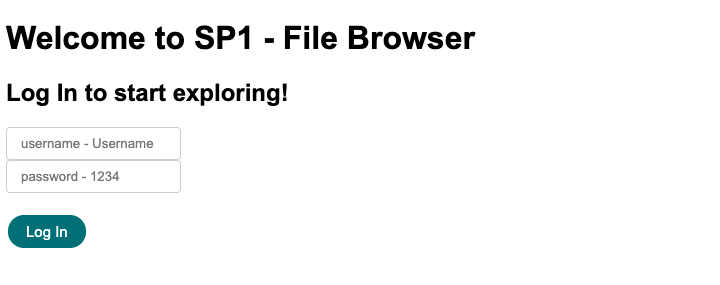

# SP1-File-Browser

Sprint #1 - File Browser

First PHP sprint tasks - simple file browser in a single file. 

## Requirements

- PHP 5.2 or higher.
- [Zip extension](http://php.net/manual/en/book.zip.php) for zip and unzip actions
- [XAMPP](https://www.apachefriends.org/download.html), [AMPPS](https://ampps.com/download) or other open-source web server platform

## How to use?

1. Download ZIP with latest version from master branch
2. Copy all the files to your website (XAMPP/AMPPS/other) folder and open it with web browser (e.g. http://localhost/file-browser/)
3. Default username: Username and password: 1234

## :file_folder: Features

#### Ability to:

<ul>
<li> Login / Logout </li>
<li> Go back using "Back" button </li>
<li> See directories content</li>
<li> Create new directories </li>
<li> Delete, Upload and Download files</li>
</ul>

## Author

[Jurgita] (https://github.com/Jjurgita)
